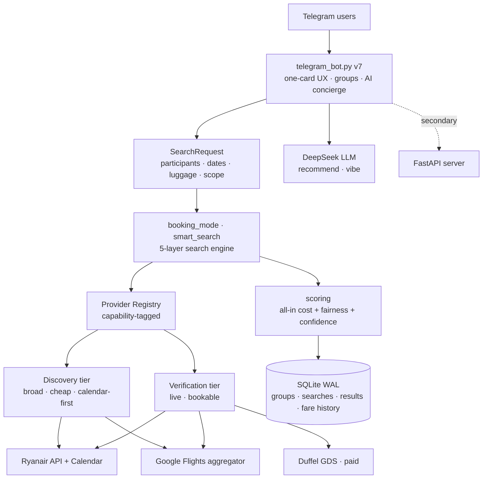

<div align="center">

# ✈️ Flight Meetup Optimizer

**Where should a group of friends meet — cheapest and fairest — when everyone flies from a different city?**

A Telegram-first travel agent that searches the whole map of European destinations and dates, ranks cities by the **true all-in cost for the whole group** (flights + luggage + airport transfers), and explains its pick with an LLM concierge.

[](https://www.python.org/)
[](https://core.telegram.org/bots)
[](https://fastapi.tiangolo.com/)
[](https://platform.deepseek.com)
[](tests/)
[](LICENSE)

</div>

---

## The problem

Planning a group reunion is a mess of open browser tabs. Everyone lives somewhere different, "cheap for me" isn't "cheap for you," and the sticker price on a flight isn't what you actually pay once bags and the airport train are added. The real question is never *"what's the cheapest flight?"* — it's:

> **Which destination, on which dates, is cheapest *and* fairest for the whole group?**

This project answers that automatically.

## What it does

- 👥 **Groups & invites** — create a group, share a one-tap Telegram invite link; friends type where they fly from (city names like `milan` work, not just IATA codes).
- 🔍 **One-tap search** — smart defaults launch a full scan in a single tap, or open a settings panel to tune dates, trip length, luggage, transfers, stops, and scope.
- 💎 **True all-in cost** — ranks cities by flights **+** airline-specific bag fees **+** airport→city transfers, per person, with a **fairness** score so no one quietly overpays.
- ✨ **AI concierge** *(DeepSeek LLM)* — "Which should we pick?" reasons over the *real computed deals* and recommends one with a human why; "Things to do" spins up a trip idea sized to your nights.
- 🔎 **Verify before booking** — re-check the exact saved itinerary live, and report what you actually paid to sharpen future estimates.
- 🔔 **Built for groups** — the whole group is pinged when results are ready; the owner is notified when someone joins.

### What a result looks like in the bot

```
🏆 Best meetups — Weekend Crew
3 cities · all-in per group · tap a city for details

🥇 🇦🇹 Vienna — €142 · 3n · 🟢
🥈 🇭🇺 Budapest — €158 · 3n · 🟡
🥉 🇵🇹 Porto — €171 · 3n · 🟢

        [ ✨ Which should we pick? ]
```
> ✨ *AI pick — Weekend Crew*
> Go with Vienna! It's the cheapest for the group at €142 and you both pay
> close amounts (€60 vs €40), so it's fair. Gorgeous coffeehouse city, too.
> Budapest is a fun runner-up if you want livelier nightlife.

---

## Architecture



The design splits work into two tiers with different jobs — **discovery** (broad, cheap, calendar-driven: *which cities/dates are worth looking at?*) and **verification** (narrow, live, bookable: *is this specific deal real right now?*). Providers declare capability tags, so adding a source is one registry entry, not a refactor.

📚 **Deep dives:** [Architecture](docs/ARCHITECTURE.md) · [Provider system](docs/PROVIDERS.md) · [Smart search layers](docs/SMART_LAYERS.md) · [Codebase guide](docs/CODEBASE_GUIDE.md) · [Complete guide](docs/COMPLETE_GUIDE.md) · [Roadmap](docs/ROADMAP.md)

---

## Engineering highlights

Things in here I'm proud of as an aspiring AI engineer:

| Area | What & why |
|---|---|
| **Capability-tagged provider registry** | Providers declare `{airline, region, cost, freshness, bookable, has_calendar, tiers}`; the engine routes by capability, not by hardcoded name strings. Adding an airline = one registry line. |
| **Discovery / verification split** | Broad scanning uses cheap month-level calendar endpoints (one call ≈ 31 days of fares); only the shortlist is verified live. ~10–50× fewer calls for discovery. |
| **Route-graph pruning** | Caches Ryanair's open route graph and skips provably-nonexistent routes in ~0.2 ms instead of a wasted HTTP call — fail-open so it never hides real routes. |
| **5-layer smart search** | Calendar pre-scan, leg combiner, provider consensus/confidence, flexible dates (min/max-night bounded), cheapest-first ordering. |
| **Honest pricing** | Real bag fees per airline, airport-transfer costs, provider-consensus confidence labels, and a live verify step — because a wrong price is worse than no price. |
| **LLM integration done safely** | The recommender is fed *only* the real computed numbers and constrained against inventing prices; every AI call fails soft so an outage never breaks the bot; responses are cached. |
| **Tested** | 42 offline tests (pure UI helpers, registry invariants, route-graph fail-open, discovery pre-scan, AI prompt-building with a mocked client) — no network needed to run them. |

---

## Tech stack

**Python 3.11+** · **python-telegram-bot** (async) · **DeepSeek** (OpenAI-compatible LLM) · **FastAPI + Uvicorn** · **SQLite (WAL)** · **fast-flights** (Google Flights) · Ryanair & Duffel APIs · **pytest**.

## Project structure

```
flight_optimizer/
├── telegram_bot.py          # v7 "one-card" Telegram UX (primary product)
├── main.py                  # search engine + CLI + booking_mode
├── flight_api_server.py     # FastAPI (secondary interface)
├── src/
│   ├── core/
│   │   ├── provider_registry.py   # capability-tagged registry + tiers
│   │   ├── providers.py           # provider classes (Ryanair, Google, Duffel…)
│   │   ├── smart_search.py        # 5 smart layers + discovery pre-scan
│   │   ├── route_graph.py         # Ryanair route-graph pruning (cached)
│   │   ├── scoring.py             # all-in cost, fairness, ranking
│   │   ├── ai_assistant.py        # DeepSeek concierge (recommend / vibe)
│   │   ├── bot_ui.py              # pure, tested UI/render helpers
│   │   ├── storage.py             # SQLite WAL persistence
│   │   └── …                      # config, cost_utils, airports, search_request
│   └── clients/                   # ryanair, google_scraper, duffel, deepseek
├── scripts/                 # nightly surface, canary, dashboard, backups
├── tests/                   # 42 offline tests
└── docs/                    # architecture & guides
```

## Quickstart

```bash
git clone https://github.com/osamaPY/flightAgent.git
cd flightAgent
pip install -r requirements.txt
cp .env.example .env          # then fill in your tokens
python telegram_bot.py
```

Minimum config in `.env`: a `TELEGRAM_BOT_TOKEN` (from [@BotFather](https://t.me/BotFather)) and your `TELEGRAM_CHAT_ID`. Everything else is optional — the AI concierge (`DEEPSEEK_API_KEY`) and Duffel (`DUFFEL_TOKEN`) enhance it but the bot runs fully free on Ryanair + Google without them.

```bash
python -m pytest -q         # run the test suite (no network needed)
python main.py health       # check live provider status
python flight_api_server.py # optional local REST API on :8000
```

---

## Notes & disclaimer

Personal / portfolio project. It reads **public and consenting** flight endpoints (Ryanair's open API, Google Flights via `fast-flights`, optional Duffel GDS) — no walled-site scraping or CAPTCHA evasion. Prices move fast; always confirm on the airline's checkout page before booking. Not affiliated with any airline.

## License

[MIT](LICENSE) © 2026 Oussama El Mir ([osamaPY](https://github.com/osamaPY))
